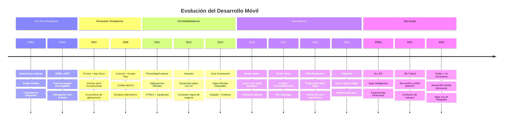
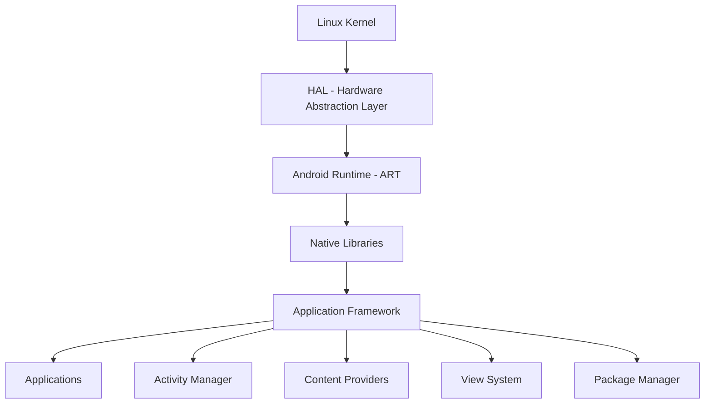
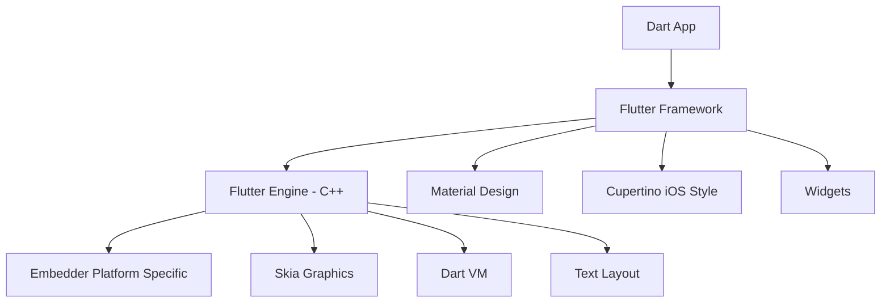

# Unidad 1: Historia y Panorama Actual del Desarrollo Móvil (2026)

## 📚 Índice

1. [Introducción y Objetivos](#introducción-y-objetivos)
2. [Historia del Desarrollo Móvil - Timeline Acelerado](#historia-del-desarrollo-móvil)
3. [La Era de los Smartphones: iOS vs Android](#la-era-de-los-smartphones)
4. [Panorama Actual 2025](#panorama-actual-2025)
5. [Android Nativo: Evolución y Estado Actual](#android-nativo-evolución-y-estado-actual)
6. [Flutter: La Apuesta de Google](#flutter-la-apuesta-de-google)
7. [Panorama de Tecnologías Multiplataforma 2025](#panorama-de-tecnologías-multiplataforma-2025)
8. [Desarrollo de Videojuegos Móviles](#desarrollo-de-videojuegos-móviles)
9. [Actividades de Evaluación](#actividades-de-evaluación)
10. [Recursos para el Curso](#recursos-para-el-curso)

---

## 🎯 Introducción y Objetivos

### Objetivos de la Unidad (3 horas)
Al finalizar esta unidad, serás capaz de:
- **Comprender** la evolución del desarrollo móvil y su estado actual
- **Identificar** las ventajas de Android nativo y Flutter
- **Analizar** el panorama del desarrollo de videojuegos móviles
- **Contextualizar** las tecnologías que aprenderemos en el curso

### ¿Por qué Estas Tecnologías?

#### 🤖 Android Nativo (sin Jetpack Compose)
- **Fundamentos sólidos**: Base para entender cómo funciona Android
- **Control total**: Acceso completo a APIs del sistema
- **Mercado laboral**: Muchas empresas aún usan Views tradicionales
- **Learning path**: Comprender antes de modernizar

#### 🎯 Flutter
- **Multiplataforma**: Un código, múltiples plataformas
- **Performance**: Rendimiento nativo en ambas plataformas
- **Tendencia creciente**: Adopción masiva en la industria
- **Productividad**: Desarrollo más rápido y eficiente

---

## 📱 Historia del Desarrollo Móvil

### 🚀 Timeline Crítico - Lo Esencial



### 🔑 Hitos Clave para Desarrolladores

| Año | Evento | Impacto en el Desarrollo |
|-----|--------|-------------------------|
| **2008** | Lanzamiento Android SDK | Desarrollo nativo gratuito |
| **2008** | App Store abierto | Modelo de monetización |
| **2009** | PhoneGap (Adobe) | Primeras apps híbridas HTML5 |
| **2011** | Android 4.0 (API 14+) | Fragmentos y UI moderna |
| **2011** | Apache Cordova | Open source de PhoneGap |
| **2012** | Xamarin fundada | Desarrollo nativo con C# |
| **2013** | Ionic Framework | Apps híbridas con Angular |
| **2015** | React Native | Facebook revoluciona cross-platform |
| **2016** | Xamarin comprada por Microsoft | Integración con Visual Studio |
| **2017** | Flutter Alpha | Google entra al juego multiplataforma |
| **2018** | PWA mainstream | Chrome y Android mejoran soporte |
| **2019** | Flutter 1.0 | Producción ready |
| **2019** | Ionic Capacitor | Sucesor de Cordova |
| **2020** | Flutter Web estable | Un código para móvil y web |
| **2021** | Jetpack Compose Stable | UI declarativa Android |
| **2021** | .NET MAUI | Evolución de Xamarin Forms |
| **2022** | React Native Fabric | Nueva arquitectura con JSI |
| **2023** | Flutter 3.10 | Material 3 y performance mejorado |
| **2024** | Ionic 8 | Mejoras significativas en rendimiento |
| **2025** | Flutter 3.X | Integración IA nativa |

---

## 📱 La Era de los Smartphones

### 🍎 iOS: El Pionero
**Filosofía**: Ecosystem cerrado, experiencia controlada

```swift
// Ejemplo conceptual iOS - Filosofía de desarrollo
class iOSPhilosophy {
    let humanInterfaceGuidelines = true
    let appStoreReview = "Strict"
    let designPrinciples = ["Clarity", "Deference", "Depth"]
    
    func developApp() {
        // Seguir las reglas estrictas de Apple
        // Diseño consistente y pulido
        // Review process obligatorio
    }
}
```

### 🤖 Android: La Revolución Abierta
**Filosofía**: Open source, flexibilidad total

```java
// Android tradicional - Views y Activities
public class MainActivity extends AppCompatActivity {
    @Override
    protected void onCreate(Bundle savedInstanceState) {
        super.onCreate(savedInstanceState);
        setContentView(R.layout.activity_main);
        
        // Libertad total de personalización
        // Múltiples fabricantes
        // Acceso a APIs del sistema
    }
}
```

### 📊 Cuota de Mercado 2025

```
🌍 Distribución Global:
├── Android: 70.8% (3.8 mil millones de dispositivos)
├── iOS: 28.4% (1.5 mil millones de dispositivos)  
└── Otros: 0.8% (HarmonyOS, KaiOS)

💰 Ingresos por App:
├── iOS: $85 mil millones (mayor ARPU)
└── Android: $47 mil millones (mayor volumen)
```

---

## 🚀 Panorama Actual 2025

### 📈 El Estado del Desarrollo Móvil

#### Estadísticas Clave
- **6.8 mil millones** de usuarios de smartphones
- **28.7 millones** de desarrolladores activos
- **4.8 horas** de uso diario promedio
- **$935 mil millones** en ingresos del sector

#### 🔧 Tecnologías Dominantes por Categoría

| Categoría | Líderes 2025 | Tendencia |
|-----------|--------------|-----------|
| **Nativo iOS** | Swift + SwiftUI | ↗️ Crecimiento estable |
| **Nativo Android** | Kotlin + Jetpack Compose | ↗️ Modernización |
| **Multiplataforma Nativo** | Flutter, React Native | 🚀 Explosión |
| **Multiplataforma .NET** | .NET MAUI (ex-Xamarin) | ↗️ Resurgimiento empresarial |
| **Híbrido Web** | Ionic + Capacitor | ↘️ Declive gradual |
| **Híbrido Legacy** | Cordova/PhoneGap | 📉 En desuso |
| **PWA** | Angular, React + PWA APIs | ↗️ Resurgimiento |
| **Low-Code** | Flutter Flow, Glide Apps | 🚀 Tendencia emergente |

### 🎯 ¿Por Qué Flutter Está Ganando?

#### Ventajas Competitivas:
1. **Un solo codebase** → iOS + Android + Web + Desktop
2. **Performance nativo** → Compilación directa, no interpretado
3. **Hot Reload** → Desarrollo 3x más rápido
4. **Google backing** → Respaldo corporativo sólido
5. **Growing ecosystem** → Paquetes y comunidad en explosión

#### Adopción Enterprise:
- **BMW**: Apps de conectividad vehicular
- **Alibaba**: Xianyu app (50M+ usuarios)
- **Google**: Google Ads, Google Pay
- **Toyota**: Apps de concesionarios

---

## 🤖 Android Nativo: Evolución y Estado Actual

### 🏗️ Arquitectura Android - Lo que Necesitas Saber



### 📚 Evolución del Development Stack

#### Era Clásica (2008-2019)
```java
// Activities + Fragments + XML Layouts
public class MainActivity extends AppCompatActivity {
    private TextView textView;
    private Button button;
    
    @Override
    protected void onCreate(Bundle savedInstanceState) {
        super.onCreate(savedInstanceState);
        setContentView(R.layout.activity_main);
        
        textView = findViewById(R.id.textView);
        button = findViewById(R.id.button);
        
        button.setOnClickListener(v -> {
            textView.setText("¡Hola desde Android!");
        });
    }
}
```

#### Era Moderna (2019-Presente)
```kotlin
// Kotlin + ViewBinding + MVVM
class MainActivity : AppCompatActivity() {
    private lateinit var binding: ActivityMainBinding
    private lateinit var viewModel: MainViewModel
    
    override fun onCreate(savedInstanceState: Bundle?) {
        super.onCreate(savedInstanceState)
        binding = ActivityMainBinding.inflate(layoutInflater)
        setContentView(binding.root)
        
        viewModel = ViewModelProvider(this)[MainViewModel::class.java]
        
        binding.button.setOnClickListener {
            viewModel.updateMessage()
        }
        
        viewModel.message.observe(this) { message ->
            binding.textView.text = message
        }
    }
}
```

### ⚡ ¿Por Qué Empezar con Views Tradicionales?

#### Ventajas Pedagógicas:
1. **Fundamentos claros**: Entender el ciclo de vida de Android
2. **Debugging más fácil**: Stack traces más comprensibles
3. **Material abundante**: Tutoriales y documentación extensa
4. **Mercado laboral**: Muchas apps legacy aún las usan

#### Herramientas de Desarrollo:
- **Android Studio**: IDE oficial de Google
- **ADB**: Android Debug Bridge
- **Emulators**: Simulación de dispositivos
- **Layout Inspector**: Debug de interfaces visuales

### 📱 Ejemplo Práctico - App "Hola Mundo"

#### Layout XML (`activity_main.xml`):
```xml
<?xml version="1.0" encoding="utf-8"?>
<LinearLayout xmlns:android="http://schemas.android.com/apk/res/android"
    android:layout_width="match_parent"
    android:layout_height="match_parent"
    android:orientation="vertical"
    android:padding="16dp"
    android:gravity="center">

    <TextView
        android:id="@+id/tv_message"
        android:layout_width="wrap_content"
        android:layout_height="wrap_content"
        android:text="¡Bienvenidos a Android!"
        android:textSize="24sp"
        android:textColor="@android:color/black"
        android:layout_marginBottom="32dp" />

    <Button
        android:id="@+id/btn_change"
        android:layout_width="wrap_content"
        android:layout_height="wrap_content"
        android:text="Cambiar Mensaje"
        android:backgroundTint="@android:color/holo_blue_dark"
        android:textColor="@android:color/white" />

</LinearLayout>
```

#### Activity Kotlin:
```kotlin
class MainActivity : AppCompatActivity() {
    private var isOriginalMessage = true
    
    override fun onCreate(savedInstanceState: Bundle?) {
        super.onCreate(savedInstanceState)
        setContentView(R.layout.activity_main)
        
        val textView = findViewById<TextView>(R.id.tv_message)
        val button = findViewById<Button>(R.id.btn_change)
        
        button.setOnClickListener {
            val newMessage = if (isOriginalMessage) {
                "¡Hola desde Kotlin!"
            } else {
                "¡Bienvenidos a Android!"
            }
            
            textView.text = newMessage
            isOriginalMessage = !isOriginalMessage
        }
    }
}
```

---

## 🎯 Flutter: La Apuesta de Google

### 🚀 ¿Qué es Flutter?

Flutter es el **framework multiplataforma** de Google que permite crear aplicaciones nativas para móvil, web y desktop desde un **único codebase**.

#### Filosofía de Flutter:
- **"Write once, run everywhere"** pero con performance nativo
- **Widget-based architecture**: Todo es un widget
- **Declarative UI**: Describes lo que quieres, no cómo conseguirlo
- **Hot reload**: Cambios instantáneos durante desarrollo

### 🏗️ Arquitectura Flutter



### 💎 Ventajas de Flutter vs Android Nativo

| Aspecto | Android Nativo | Flutter |
|---------|---------------|---------|
| **Desarrollo** | Específico Android | iOS + Android |
| **Lenguaje** | Kotlin/Java | Dart |
| **UI Framework** | Views/Compose | Widgets |
| **Performance** | Óptimo | Casi nativo (95%+) |
| **Tiempo desarrollo** | 100% | 50-60% |
| **Mantenimiento** | 2 codebases | 1 codebase |
| **Acceso APIs nativas** | Total | Plugins/Platform channels |

### 🎨 Flutter vs Android - Ejemplo Comparativo

#### Android Nativo (Kotlin):
```kotlin
// MainActivity.kt
class MainActivity : AppCompatActivity() {
    private var counter = 0
    
    override fun onCreate(savedInstanceState: Bundle?) {
        super.onCreate(savedInstanceState)
        setContentView(R.layout.activity_main)
        
        val counterText = findViewById<TextView>(R.id.counter_text)
        val incrementButton = findViewById<Button>(R.id.increment_button)
        
        updateCounterText(counterText)
        
        incrementButton.setOnClickListener {
            counter++
            updateCounterText(counterText)
        }
    }
    
    private fun updateCounterText(textView: TextView) {
        textView.text = "Contador: $counter"
    }
}
```

```xml
<!-- activity_main.xml -->
<LinearLayout xmlns:android="http://schemas.android.com/apk/res/android"
    android:layout_width="match_parent"
    android:layout_height="match_parent"
    android:orientation="vertical"
    android:gravity="center">

    <TextView
        android:id="@+id/counter_text"
        android:layout_width="wrap_content"
        android:layout_height="wrap_content"
        android:textSize="24sp" />

    <Button
        android:id="@+id/increment_button"
        android:layout_width="wrap_content"
        android:layout_height="wrap_content"
        android:text="Incrementar" />

</LinearLayout>
```

#### Flutter (Dart):
```dart
import 'package:flutter/material.dart';

void main() {
  runApp(MyApp());
}

class MyApp extends StatelessWidget {
  @override
  Widget build(BuildContext context) {
    return MaterialApp(
      title: 'Flutter Demo',
      theme: ThemeData(
        primarySwatch: Colors.blue,
      ),
      home: CounterPage(),
    );
  }
}

class CounterPage extends StatefulWidget {
  @override
  _CounterPageState createState() => _CounterPageState();
}

class _CounterPageState extends State<CounterPage> {
  int _counter = 0;

  void _incrementCounter() {
    setState(() {
      _counter++;
    });
  }

  @override
  Widget build(BuildContext context) {
    return Scaffold(
      appBar: AppBar(
        title: Text('Flutter Counter'),
      ),
      body: Center(
        child: Column(
          mainAxisAlignment: MainAxisAlignment.center,
          children: <Widget>[
            Text(
              'Contador: $_counter',
              style: TextStyle(fontSize: 24),
            ),
            SizedBox(height: 20),
            ElevatedButton(
              onPressed: _incrementCounter,
              child: Text('Incrementar'),
            ),
          ],
        ),
      ),
    );
  }
}
```

### 📈 Crecimiento de Flutter (2025)

#### Estadísticas de Adopción:
- **600,000+** apps publicadas usando Flutter
- **46%** de desarrolladores multiplataforma lo usan
- **Google, BMW, Alibaba** entre usuarios enterprise
- **#1** framework multiplataforma en Stack Overflow Survey 2024

#### ¿Por Qué Está Triunfando Flutter?

1. **Developer Experience**: Hot reload = productividad extrema
2. **Performance**: Compilación nativa vs interpretación híbrida
3. **Design Systems**: Material Design y Cupertino integrados
4. **Community**: Ecosistema de packages en explosión
5. **Google Support**: Inversión masiva en el framework

---

## 🔄 Panorama de Tecnologías Multiplataforma 2025

El desarrollo multiplataforma ha evolucionado significativamente desde las primeras soluciones híbridas. Cada tecnología tiene sus fortalezas y casos de uso específicos.

### 📊 Comparativa de Frameworks Multiplataforma

| Framework | Lanzamiento | Lenguaje | Performance | Curva Aprendizaje | Adopción 2025 |
|-----------|-------------|----------|-------------|-------------------|---------------|
| **Flutter** | 2017 | Dart | 95% nativo | Media | 🚀 Alta |
| **React Native** | 2015 | JavaScript/TypeScript | 85% nativo | Baja | 📈 Alta |
| **.NET MAUI** | 2021 | C# | 90% nativo | Alta | 📊 Media |
| **Ionic** | 2013 | JavaScript/TypeScript | 70% web | Baja | 📉 Declive |
| **Xamarin** | 2012 | C# | 95% nativo | Alta | 📉 Legacy |

### ⚛️ React Native - La Apuesta de Meta

**Philosophy**: "Learn once, write anywhere" - Aprovecha el conocimiento de React para desarrollo móvil.

#### Ventajas de React Native:
- **Ecosistema JavaScript**: Aprovecha npm y la comunidad JS
- **Hot Reloading**: Desarrollo rápido como Flutter  
- **Native Modules**: Fácil integración con código nativo
- **Community**: Segunda comunidad más grande después de Flutter
- **Facebook/Meta backing**: Usado en Instagram, Facebook, WhatsApp

#### Casos de Uso Ideales:
- Equipos con experiencia en React
- Apps con mucha lógica de negocio
- Integración con APIs REST complejas
- Startups que necesitan rapidez de desarrollo

```javascript
// Ejemplo React Native - Component básico
import React, { useState } from 'react';
import { View, Text, TouchableOpacity, StyleSheet } from 'react-native';

const CounterApp = () => {
  const [count, setCount] = useState(0);

  return (
    <View style={styles.container}>
      <Text style={styles.title}>Contador: {count}</Text>
      <TouchableOpacity 
        style={styles.button}
        onPress={() => setCount(count + 1)}
      >
        <Text style={styles.buttonText}>Incrementar</Text>
      </TouchableOpacity>
    </View>
  );
};

const styles = StyleSheet.create({
  container: {
    flex: 1,
    justifyContent: 'center',
    alignItems: 'center',
    backgroundColor: '#F5FCFF',
  },
  title: {
    fontSize: 24,
    marginBottom: 20,
  },
  button: {
    backgroundColor: '#007AFF',
    padding: 15,
    borderRadius: 5,
  },
  buttonText: {
    color: 'white',
    fontSize: 16,
  },
});

export default CounterApp;
```

### 🏢 .NET MAUI - El Resurgimiento de Microsoft

**.NET Multi-platform App UI** es la evolución de Xamarin.Forms, unificando el desarrollo para móvil, desktop y web.

#### Ventajas de .NET MAUI:
- **Ecosistema .NET**: Integración total con Visual Studio
- **Performance nativa**: Compilación AOT como Flutter
- **Enterprise ready**: Ideal para empresas Microsoft-centric
- **Hot Reload**: Desarrollo rápido visual
- **Unified project**: Un proyecto para todas las plataformas

#### Casos de Uso Ideales:
- Empresas con stack Microsoft (.NET, Azure, Office 365)
- Apps empresariales con lógica compleja
- Desarrolladores con experiencia en C#
- Necesidad de integración con servicios Microsoft

```csharp
// Ejemplo .NET MAUI - Page con MVVM
using Microsoft.Maui.Controls;

namespace MauiApp.Views;

public partial class CounterPage : ContentPage
{
    private int _count = 0;
    
    public CounterPage()
    {
        InitializeComponent();
    }

    private void OnCounterClicked(object sender, EventArgs e)
    {
        _count++;
        CounterLabel.Text = $"Contador: {_count}";
        
        if (_count == 1)
            CounterButton.Text = "Click me again";
    }
}
```

```xml
<!-- CounterPage.xaml -->
<?xml version="1.0" encoding="utf-8" ?>
<ContentPage x:Class="MauiApp.Views.CounterPage"
             xmlns="http://schemas.microsoft.com/dotnet/2021/maui"
             xmlns:x="http://schemas.microsoft.com/winfx/2009/xaml">
    
    <ScrollView>
        <VerticalStackLayout Spacing="25" Padding="30,0" 
                           VerticalOptions="Center">
            
            <Label x:Name="CounterLabel"
                   Text="Contador: 0"
                   FontSize="24"
                   HorizontalOptions="Center" />

            <Button x:Name="CounterButton"
                    Text="Click me"
                    Clicked="OnCounterClicked"
                    HorizontalOptions="Center" />

        </VerticalStackLayout>
    </ScrollView>

</ContentPage>
```

### 🌊 Ionic - El Veterano en Transición

Ionic ha evolucionado desde sus inicios como framework híbrido hasta convertirse en una plataforma completa con **Capacitor**.

#### Evolución de Ionic:
- **Ionic 1** (2013): AngularJS + Cordova
- **Ionic 2-7** (2016-2023): Angular + mejor performance  
- **Ionic 8** (2024): Framework agnostic (Angular, React, Vue)
- **Capacitor**: Reemplazo moderno de Cordova

#### Ventajas actuales:
- **Web-first**: Desarrollo web que funciona en móvil
- **Framework choice**: Angular, React, Vue compatible
- **PWA excellence**: Las mejores PWAs del mercado
- **Capacitor**: Bridge nativo moderno y eficiente

#### Casos de Uso Ideales:
- Equipos web que quieren expandir a móvil
- Apps con mucho contenido (noticias, e-commerce)
- PWAs que necesitan funcionalidad nativa
- Prototipado rápido

```typescript
// Ejemplo Ionic + Angular
import { Component } from '@angular/core';

@Component({
  selector: 'app-counter',
  template: `
    <ion-header [translucent]="true">
      <ion-toolbar>
        <ion-title>Contador App</ion-title>
      </ion-toolbar>
    </ion-header>

    <ion-content [fullscreen]="true" class="ion-padding">
      <div class="container">
        <ion-text color="primary">
          <h2>Contador: {{ count }}</h2>
        </ion-text>
        
        <ion-button 
          expand="block" 
          (click)="increment()"
          color="primary">
          Incrementar
        </ion-button>
      </div>
    </ion-content>
  `,
  styleUrls: ['./counter.page.scss']
})
export class CounterPage {
  count: number = 0;

  increment() {
    this.count++;
  }
}
```

### 📊 Criterios de Selección 2025

#### ¿Cuál Elegir en 2025?

**Flutter si:**
- ✅ Necesitas performance near-native
- ✅ Quieres una sola codebase para móvil, web y desktop
- ✅ El equipo puede aprender Dart
- ✅ Google backing es importante

**React Native si:**
- ✅ El equipo ya conoce React/JavaScript
- ✅ Necesitas flexibilidad en native modules
- ✅ Quieres aprovechar el ecosistema npm
- ✅ Meta backing y comunidad son importantes

**.NET MAUI si:**
- ✅ Empresa con stack Microsoft
- ✅ Desarrolladores con experiencia C#
- ✅ Necesitas integración enterprise
- ✅ Budget permite licencias Microsoft

**Ionic + Capacitor si:**
- ✅ Equipo web (Angular/React/Vue)
- ✅ PWA es prioridad
- ✅ Prototipado rápido
- ✅ Budget limitado

### 🔮 Tendencias Futuras

#### Lo que Viene:
- **AI Integration**: Todos los frameworks integrarán IA
- **Performance parity**: Gap con nativo cada vez menor
- **Developer Experience**: Hot reload y debugging mejorados
- **Web convergence**: PWA + native features convergiendo

---

## 🎮 Desarrollo de Videojuegos Móviles

El mercado de videojuegos móviles representa **$103 mil millones** en 2025, siendo el segmento más grande de la industria gaming.

### 📊 Panorama del Gaming Móvil 2025

#### Números Clave:
- **3.2 mil millones** de gamers móviles activos
- **54%** de todos los ingresos gaming globales
- **Candy Crush** sigue siendo el rey (>$20M mensuales)
- **Genshin Impact** lidera los RPG móviles ($300M+ mensuales)

#### Géneros Dominantes:
1. **Puzzle/Casual**: Candy Crush, Among Us
2. **Battle Royale**: PUBG Mobile, Free Fire
3. **RPG/Gacha**: Genshin Impact, Honkai Star Rail
4. **Strategy**: Clash of Clans, Rise of Kingdoms
5. **Hypercasual**: Subway Surfers, Temple Run

### 🛠️ Tecnologías de Desarrollo

#### 🎯 Unity - El Rey del Gaming Móvil

Más del 70% de los juegos para dispositivos móviles se crean en Unity, convirtiéndolo en el motor dominante del sector.

**Ventajas de Unity:**
- **Multiplataforma**: iOS, Android, PC, Console, Web
- **Asset Store**: Marketplace masivo de assets y scripts
- **Visual Scripting**: Desarrollo sin código para diseñadores
- **2D y 3D**: Versatilidad completa
- **Community**: Comunidad gigante y tutoriales infinitos

```csharp
// Ejemplo Unity - Script básico de movimiento
using UnityEngine;

public class PlayerMovement : MonoBehaviour
{
    public float speed = 5.0f;
    private Rigidbody2D rb;
    
    void Start()
    {
        rb = GetComponent<Rigidbody2D>();
    }
    
    void Update()
    {
        // Input táctil para móviles
        if (Input.touchCount > 0)
        {
            Touch touch = Input.GetTouch(0);
            Vector2 touchPosition = Camera.main.ScreenToWorldPoint(touch.position);
            
            Vector2 direction = (touchPosition - rb.position).normalized;
            rb.velocity = direction * speed;
        }
    }
}
```

#### 🎮 Unreal Engine - Gráficos de Nueva Generación

Unreal Engine incluye todo lo necesario para crear juegos para móvil y multiplataforma muy realistas, aunque tradicionalmente se ha enfocado más en PC y consolas.

**Ventajas de Unreal:**
- **Gráficos Premium**: Fotorealismo sin rival
- **Blueprint System**: Programación visual avanzada
- **Nanite Virtualized Geometry**: Tecnología de vanguardia
- **Free**: Gratis hasta $1M de ingresos

**Desventajas para Móvil:**
- **Tamaño**: Apps más pesadas (>100MB)
- **Rendimiento**: el proceso suele implicar la simplificación de shaders, métodos de renderizado, etc. (que por defecto están orientados a formatos AAA)
- **Curva de aprendizaje**: Más complejo que Unity

#### 🚀 Engines Alternativos

**Godot** (Open Source):
- Completamente gratuito
- Scripting con GDScript o C#
- Lightweight para móviles
- Crecimiento exponencial en 2025

**Defold** (King/Activision):
- Especializado en 2D
- Lua scripting
- Apps ultra-ligeras (<10MB)
- Usado por King (Candy Crush)

### 🎮 Géneros y Tecnologías Específicas

#### Casual/Hypercasual Games
- **Unity 2D** + **C#**
- Desarrollo rápido (2-4 semanas)
- Monetización por ads
- Mecánicas simples, adictivas

#### Mid-Core Games (RPG, Strategy)
- **Unity 3D** o **Unreal**
- Desarrollo largo (6-18 meses)
- Monetización F2P + IAP
- Mecánicas complejas, meta-game

#### Premium/Console-Quality
- **Unreal Engine** principalmente
- Desarrollo AAA (12-36 meses)
- Monetización premium ($10-60)
- Gráficos fotorealistas

